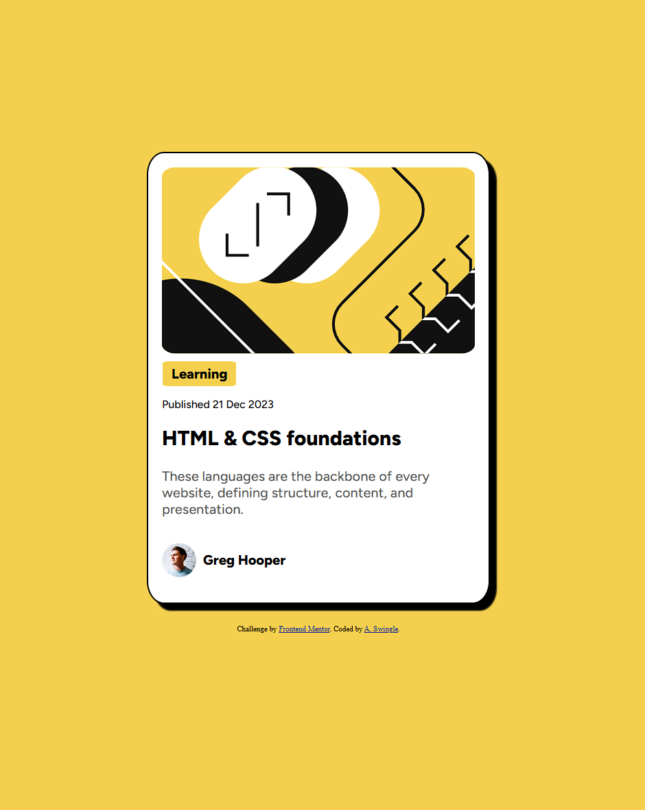

# Frontend Mentor - Blog preview card solution

This is a solution to the [Blog preview card challenge on Frontend Mentor](https://www.frontendmentor.io/challenges/blog-preview-card-ckPaj01IcS). Frontend Mentor challenges help you improve your coding skills by building realistic projects.

Viewable at this link: https://metalfenser.github.io/Challenge-1-Blog-Preview-Card/

## Table of contents

- [Overview](#overview)
  - [The challenge](#the-challenge)
  - [Screenshot](#screenshot)
  - [Links](#links)
- [My process](#my-process)
  - [Built with](#built-with)
  - [What I learned](#what-i-learned)
  - [Continued development](#continued-development)
  - [Useful resources](#useful-resources)
- [Author](#author)
- [Acknowledgments](#acknowledgments)

## Overview

First time trying an HTML and CSS challenge. I knew a little bit but struggled with sizing the top image and getting every thing to line up in a column instead of in a row across the screen.

### The challenge

Users should be able to:

- See hover and focus states for all interactive elements on the page
  - I just added a hover effect onto the card since none of the elements on the card seemed like something that should be clicked or hovered on to reveal something else. Probably not what was intended but I don't know what else was meant.

### Screenshot



### Links

- Solution URL: [Add solution URL here](https://your-solution-url.com)
- Live Site URL: (https://metalfenser.github.io/Challenge-1-Blog-Preview-Card/)

## My process

I started with creating a div for the entire blog card and then a div for each element that will be in the card. The first image, four paragraph elements, the second image and a final paragraph element. I then worked on creating a border for the card for all of my elements to fit inside. I then gave each div a class and then started working in the CSS file to style each div from top to bottom. Once they were all styled, I played with the first image width for like 30 minutes. Used the internet to help me figure out I needed another div and give that div for the image width = 100%. Then I made the background color yellow and middle-middled the blog card.

### Built with

- Semantic HTML5 markup
- CSS custom properties
- Flexbox
- CSS Grid

### What I learned

I learned how to organize items in a column, set a background color for the page and the card, how to max width of the photo with adding another div and what margin is. I also learned how to link a font-family in CSS with @font-face.
See below:

```html
<div class="screen">
  <div class="blog-card">
    <div class="heading-image-container">
      //I learned about image width in this div //
      
    </div>
    <div class="category">
      <div class="category-border">
        <p class="category-text">Learning</p>
      </div>
    </div>
    <div>
      <p class="publish-date">Published 21 Dec 2023</p>
    </div>
    <h2>HTML & CSS foundations</h2>
    <p class="description-gray">
      These languages are the backbone of every website, defining structure,
      content, and presentation.
    </p>
    <div class="user-profile-combo">
      
      <p class="username">Greg Hooper</p>
    </div>
  </div>
</div>
```

```css
@font-face {
  font-family: "Figtree";
  src: url("assets/fonts/static/Figtree-Medium.ttf") format("truetype");
  font-weight: 500; /* Medium*/
}

.blog-card {
  display: flex;
  flex-direction: column;
  align-items: flex-start;
  width: 100%;
  max-width: 500px;
  height: auto;
  border: 2px solid black;
  padding: 20px;
  box-sizing: border-box;
  box-shadow: 10px 10px 2px black;
  border-radius: 5%;
  background-color: white;
}

.heading-image-container {
  //I learned about imagewidth in this div //
  width: 100%;
}

.heading-image {
  //I learned about imagewidth in this div //
  width: 100%;
  height: auto;
  display: block;
  border-radius: 5%;
}
```

```js
None for this page

### Continued development

Margin and organizing items on the page where I want them to go.

### Useful resources

Internet

## Author

- Frontend Mentor - [@metalfenser](https://www.frontendmentor.io/profile/metalfenser)

## Acknowledgments

None this time.
```
